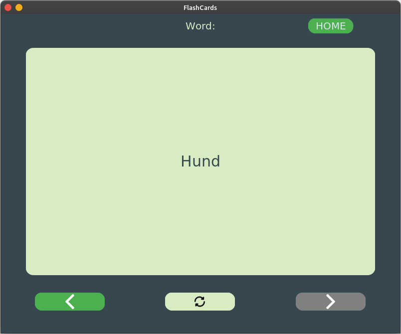

# FlashCards App

## Description
The FlashLearn App is a Python-based application that allows users to create, view, and learn flashcards. The graphical user interface (GUI) is built using the `customtkinter` library, and the card data is stored in a JSON file. This is my first attempt of working with `customtkinter` and `tkinter` in general.

## Screenshots
 
 
 
 
## Features
- **View Cards:** View all the flashcards in a scrollable list.
- **Learn Cards:** Traverse through the flashcards one by one and flip them to see the translation or additional information.

## Prerequisites
- Python 3.x
- `customtkinter` library
- `PIL` (Python Imaging Library) for image handling

## Installation
1. Clone the repository:
    ```sh
    git clone https://github.com/KrystynaLysenko/FlashLearn1
    ```
2. Install the required libraries:
    ```sh
    pip install customtkinter pillow
    ```

## Usage
1. Run the application:
    ```sh
    python main.py
    ```
2. Use the home screen to navigate:
    - **START LEARNING:** Navigate to the learning screen to start reviewing cards.
    - **VIEW CARDS:** View all cards in a scrollable list.
    - **ADD NEW CARD:** Functionality to add new cards is not yet implemented.
    - **EXIT:** Exit the application.

## File Structure
- **main.py:** The main application file containing the GUI logic.
- **cards.py:** Contains the `Card` and `CardList` classes for managing flashcards.
- **assets/**: Directory containing image assets such as the logo and icons.

## Classes
### Card
Represents a single card in the flashcard list.

- **Attributes:**
  - `value`: A tuple containing front text, back text, and image path.
  - `next_card`: Reference to the next card.
  - `prev_card`: Reference to the previous card.
  
- **Methods:**
  - `get_value()`, `get_front_value()`, `get_back_value()`, `get_img_path()`: Get card values.
  - `get_next_card()`, `get_prev_card()`: Get next and previous cards.
  - `set_next_card(next_card)`, `set_prev_card(prev_card)`: Set next and previous cards.

### CardList
Manages a doubly linked list of `Card` objects.

- **Attributes:**
  - `first_card`: The first card in the list.
  - `last_card`: The last card in the list.
  - `current_card`: The current card in the list.

- **Methods:**
  - `set_first_card(new_first_card)`, `set_last_card(new_last_card)`: Set the first and last cards.
  - `get_first_card()`, `get_last_card()`: Get the first and last cards.
  - `add_to_beginning(value_to_add)`, `add_to_end(value_to_add)`: Add cards to the beginning or end of the list.
  - `traverse_forward()`, `traverse_backward()`: Traverse the list.
  - `load_cards()`: Load cards from a JSON file.

## Note
- The functionality to add new cards through the GUI is not implemented yet.

## License
This project is licensed under the MIT License.

---

Feel free to adjust any section as needed for your specific project details.
